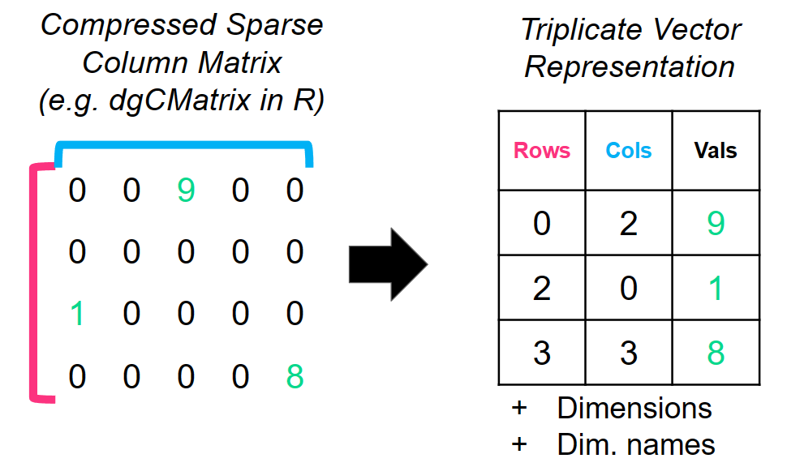

```{r, include = FALSE}
knitr::opts_chunk$set(
  collapse = TRUE,
  comment = "#>"
)
```

## dbMatrix
`dbMatrix` is a core package in the [`dbverse`](https://drieslab.github.io/dbverse/) library that inherits from the `dbData` base class and consists of two subclasses, `dbSparseMatrix` and `dbDenseMatrix`.

`dbMatrix` objects emulate in-memory dense and sparse matrices in an embedded database powered by DuckDB. 


## dbSparseMatrix


Sparse matrices are represented as triplet vectors with `i`, `j`,
and `x` numerical vectors. `i` and `j` refer to the row and column indices, respectively, with specific `x` values or counts. Note: The `i` and `j` vectors are one-based following conventions from the `Matrix` R package and the `TSparseMatrix` class.

The `dbSparseMatrix` class stores the triplet vector representation with its associated dimension names and dimensions if available. If none are provided, they are automatically generated as factors (enums) with `row#` or `col#` labels for rownames and colnames, respectively. The `dbSparseMatrix` class does not contain zeros in the triplet vector representation. Zero values are inferred based on the provided dimensions.

Support for compressed sparse column matrices of the `dgCMatrix` class from the `Matrix` R package is currently implemented. For more information about sparse matrices, see [the wiki article here ](https://en.wikipedia.org/wiki/Sparse_matrix). 


## dbDenseMatrix

We use the same approach as `dbSparseMatrix` to represent a dense matrix as a
triplet `i`, `j`, and `x` vector. The only difference is that the `dbDenseMatrix` class consists of all values in the matrix, including zeros.


